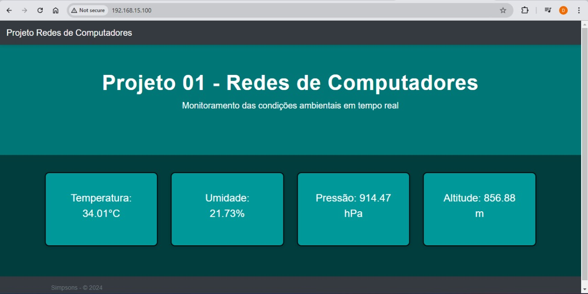

# Projeto de Comunicação Cliente-Servidor com ESP32 e Sockets

## Vídeo Explicativo


Para assistir ao vídeo explicativo sobre o projeto, clique [video_youtube](https://www.youtube.com/watch?v=qt7NFXhU74o).

Este projeto foi desenvolvido como parte da disciplina SSC0641 - Redes de Computadores (2024) do curso de Engenharia de Computação da Universidade de São Paulo (USP). O objetivo principal é implementar uma comunicação cliente-servidor usando **sockets** e **websockets**, para coletar dados de sensores de um **ESP32** e transmiti-los ao cliente através de uma rede local.

## Lógica do Projeto

### Cronologia da Comunicação:

1. **Requisição do Cliente**: O cliente faz uma requisição para o servidor, solicitando os dados de sensores do ESP32.
   
2. **Interação com o ESP32**: Assim que o servidor recebe a requisição do cliente, ele se comunica com o ESP32 (que está na mesma rede) via TCP (protocolo IPv4) e solicita uma página HTML que contém os dados de temperatura, umidade, altitude e pressão atmosférica local.

3. **Processamento dos Dados**: O servidor recebe a resposta em formato HTML do ESP32, filtra os dados relevantes e limpa o conteúdo desnecessário.

4. **Envio ao Cliente**: Após o processamento, o servidor envia os dados filtrados para o cliente via socket, encerrando a comunicação.

### Tecnologias Utilizadas:
- **C++**: Programação Orientada a Objetos (POO) para estruturar o projeto.
- **Sockets**: Comunicação entre dispositivos na mesma rede utilizando a porta 80 para se conectar ao ESP32 e receber os dados em formato HTML.
- **ESP32**: Fonte de dados, fornecendo informações de sensores via uma página HTML.

### Lógica do Projeto

1. **Requisição do Cliente**: O cliente faz uma requisição para o servidor, solicitando os dados de sensores do ESP32.
   
2. **Interação com o ESP32**: Assim que o servidor recebe a requisição do cliente, ele se comunica com o ESP32 (que está na mesma rede) através de um **socket TCP** na porta 80, solicitando uma página HTML que contém os dados de temperatura, umidade, altitude e pressão atmosférica local.

3. **Processamento dos Dados**: O servidor recebe a resposta em formato HTML do ESP32, filtra os dados relevantes e limpa o conteúdo desnecessário.

4. **Envio ao Cliente**: Após o processamento, o servidor envia os dados filtrados para o cliente via socket, encerrando a comunicação.


## Apresentação

O projeto envolve a implementação de threads para lidar com diferentes grandezas (temperatura, umidade, altitude, pressão), fechando pares de comunicação entre o cliente e o servidor. A lógica foi desenvolvida para funcionar tanto em um **Raspberry Pi** quanto em qualquer outro dispositivo Linux que esteja na mesma rede dos clientes.

## Integrantes

- **Lucas Sales Duarte** - 11734490
- **Daniel Dias Silva Filho** - 13677114
- **Daniel Umeda Kuhn** - 13676541  
- **Manoel Thomaz Gama da Silva Neto** - 13676392

Universidade de São Paulo (USP)

Disciplina: SSC0641 - Redes de Computadores (2024)


### Exemplo de Interface HTML:


## Instruções para Compilação e Execução

1. Clone este repositório em sua máquina local.
2. Use o `makefile` incluso para compilar o projeto:
   ```bash
   make
   ```
   Iniciar o `server` em uma máquina
   ```bash
   ./client
   ```
   Iniciar o `client` em uma máquina
   ```bash
   ./client
   ```

Para que esse socket funcione, é necessário que haja um ESP32 esteja executando o arquivo `ESP32.ino` gerando os HTMLs na rede local.